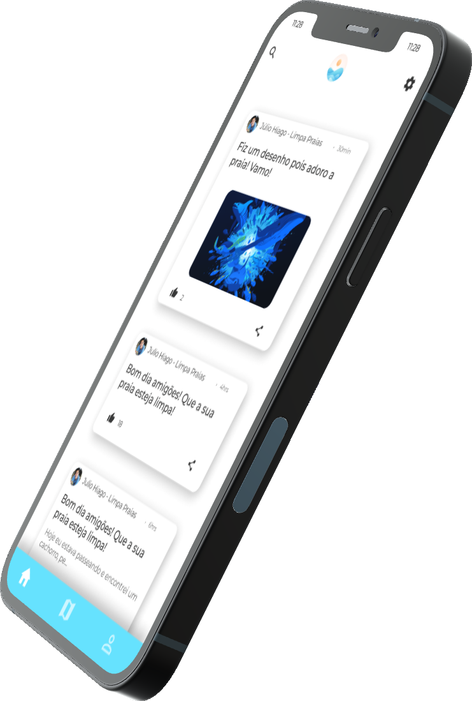

# Oclean

## O aplicativo que salva praias

Somos a Oclean, um aplicativo feito especialmente para ajudar a limpar as praias e deixá-las mais agradáveis para todo mundo!!

	

# Proposta

Recentemente, as praias estão sendo bombardeadas com lixos, estragando a experiência dos turistas e ameaçando a vida marinha local.  
Indignados com a situação, criamos um aplicativo que possa ajudar as ONGs a deixarem essas praias mais limpas, além de criar comunidades para as pessoas interagirem e anunciar os seus trabalhos recentes.

	

O Oclean proprociona ao usuário uma interação com as ONGs e outros usários por meio das comunidades e dos posts que podem ser feitos.  
Acreditamos que, ao criar esse aplicativo, ajudaremos as ONGs com uma maior interação e proximidade à população que está preocupada com a atual sitaução das praias brasileiras.

[Vídeo promocional de apresentação do aplicativo Oclean](https://www.youtube.com/watch?v=BKRdWPWVfJs)

# Observações sobre o projeto

O projeto Oclean foi desenvolvido para a disciplina Trabalho de Conclusão de Curso (TCC) do curso de Desenvolvimento de Sistemas da instituição Escola Técnica Estadual (ETEC) Professor Horácio Augusto da Silveira durante o ano inteiro de 2021
